# CloutHaus: Social Media Leads to Compromise
**KC7 Investigation — Score: 1170 pts | Role: SOC Analyst**

## Scenario
Afomiya Storm, a rising social media influencer (700K followers), just joined CloutHaus as an Influencer Partner. A "brand collaboration" email lands in her corporate inbox. One click later, an attacker has her credentials — and no MFA to stop them. What follows is account takeover, personal-life reconnaissance, quiet exfiltration of sensitive documents through forwarded email, a parallel Instagram hijack used to scam her followers, and finally an attempt to take over her *personal* Gmail using information the attacker gathered along the way.

This repo documents the full investigation: every KQL query run, the evidence returned at each step, and how the pieces connect into one attack chain.

---

## TL;DR Attack Chain

```
Public Instagram profile (700K followers, bio lists personal Gmail,
location, and other personal detail) — the recon surface
        │
        ▼
Phishing email (fake Dior partnership) sent to her corporate inbox
        │
        ▼
She clicks the link → credential-harvesting login page (super-brand-offer[.]com)
        │
        ▼
Credentials captured in a cleartext GET request
        │
        ▼
Attacker logs in as afstorm — no MFA — from an anomalous IP/User-Agent
        │
        ▼
Attacker researches the victim personally (home address, Venmo, "how to hack Instagram")
        │
        ├──▶ Instagram hijacked → DMs her followers for "investment" money
        │
        ├──▶ From inside her mailbox, attacker forwards her NDA, payment/bank
        │     details, and passport scan to an attacker-controlled domain
        │
        ▼
Weeks later: attacker uses OSINT gathered earlier (first school, mother's
maiden name) to attempt a password reset on her personal Gmail via
security questions
```

**Why this matters:** the attack doesn't stop at the corporate boundary. The attacker treats Afomiya's own public oversharing as an asset — her Instagram bio and posts feed a second attack against a completely separate personal account that CloutHaus's security controls have no visibility into.

---

## Step-by-Step Methodology

### Step 1 — The recon surface: a public profile that overshares
Before touching any logs, the starting point for *why* Afomiya specifically was targeted is her own public Instagram profile: 700K followers, a bio that lists her personal ("business only") Gmail address, her DC location, and lifestyle content that signals disposable income — exactly the profile of someone attackers expect to have a trusting, engaged audience.

```
Bio: "GRWM addict | Life, fashion, vibes 🎬 & DC-based & camera-ready"
Email: afomiya.storm@gmail.com (business only, pls don't be weird)
Followers: 700,000 | Following: 333 | Posts: 1,216
```

This single bio line hands an attacker her personal email address for free — the same account they'll later try to take over in Step 16.

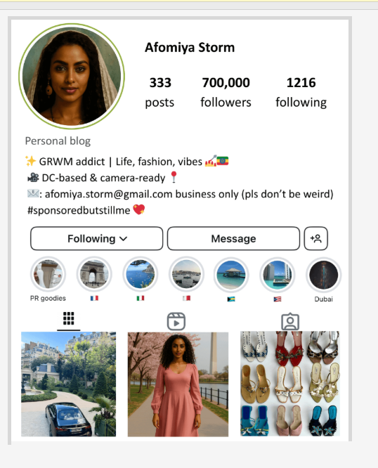

**The real root cause, though, is this:** Afomiya ran an Instagram Story "Q&A sticker" — a "ask me questions to pass the time on my flight 😊" game — and answered follower questions with, in order: her childhood pet's name (`Arsema`), where she grew up (`Washington, DC`), her mother's maiden name (`Kidus`), and the name of her first school (`Lalibela High`). Two of those four answers are word-for-word the exact security questions Gmail uses for account recovery. She didn't leak this data to a hacker directly — she posted it for fun, publicly, to 700K followers, not realizing two of her "harmless" answers were also her bank-vault key.

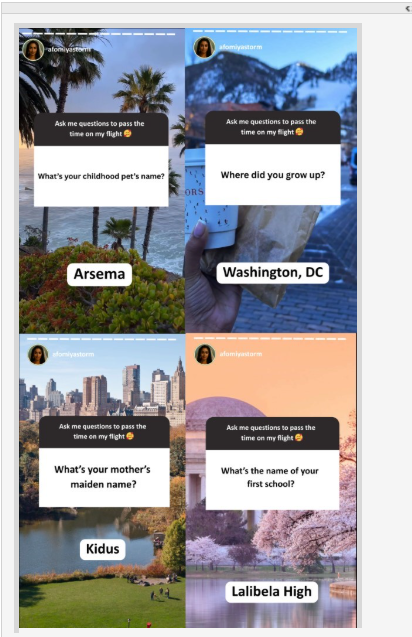

---

### Step 2 — Confirm the victim's identity and control gaps
Pivoted into `Employees` to confirm her CloutHaus identity, role, and — critically — MFA status.

```kql
Employees
| where name contains "afomiya"
```

**Finding:** Afomiya Storm, Influencer Partner, `mfa_enabled: False`, username `afstorm`, domain `clouthaus.com`. This missing control is the single point of failure that lets a stolen password become full account takeover.

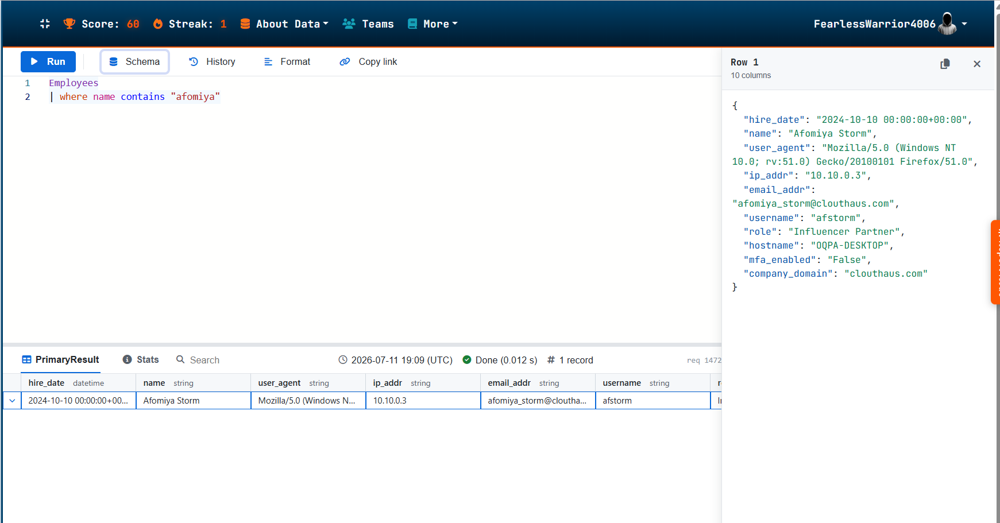

---

### Step 3 — Find the phishing email
Searched `Email` for anything sent to her from an unfamiliar "brand" sender.

```kql
Email
| where recipient == "afomiya_storm@clouthaus.com"
| where sender contains "dior"
```

**Finding:** An email from `collabs@dior-partners.com`, subject *"[EXTERNAL] Exclusive Partnership Opportunity with Dior"*, containing a link to `https://super-brand-offer.com/login`. The mail filter verdict: **CLEAN** — this got past detection entirely.

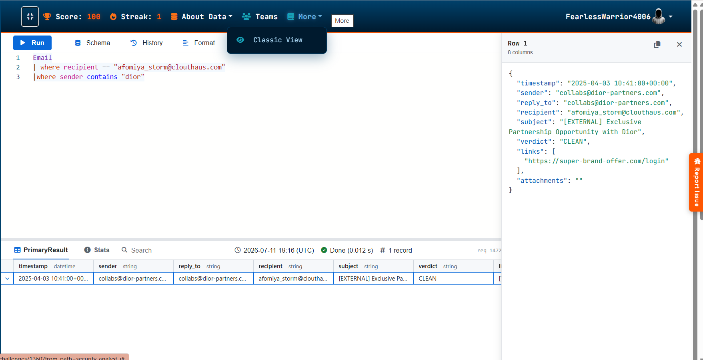

---

### Step 4 — Confirm the click
Checked `OutboundNetworkEvents` to see whether her machine actually reached that link.

```kql
OutboundNetworkEvents
| where url contains "https://super-brand-offer.com/login"
```

**Finding:** Two GET requests from her device (`10.10.0.3`), seconds apart — one loading the page, one submitting the form.

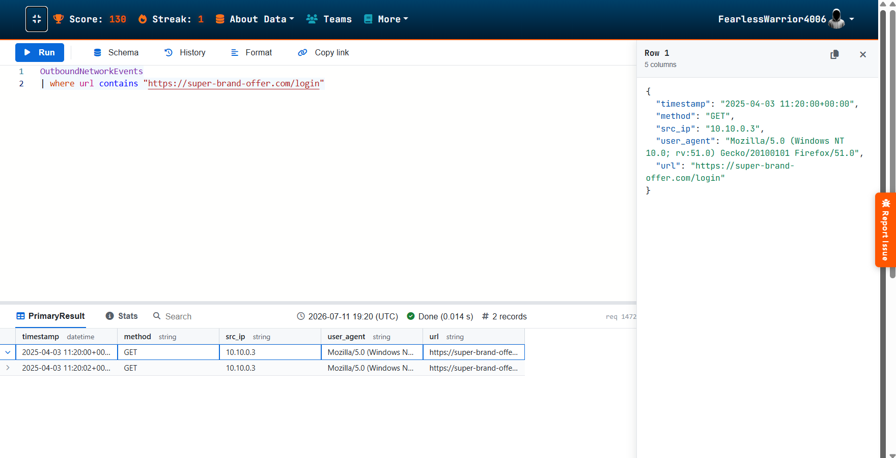

---

### Step 5 — Confirm the credentials were captured
Expanded on the same query to inspect the second request's full URL.

**Finding:** The login form submitted her credentials as GET parameters, in cleartext:

```
...login?username=afstorm&password=**********
```

A classic credential-harvesting page — no proper POST, no encryption, just a plaintext capture.

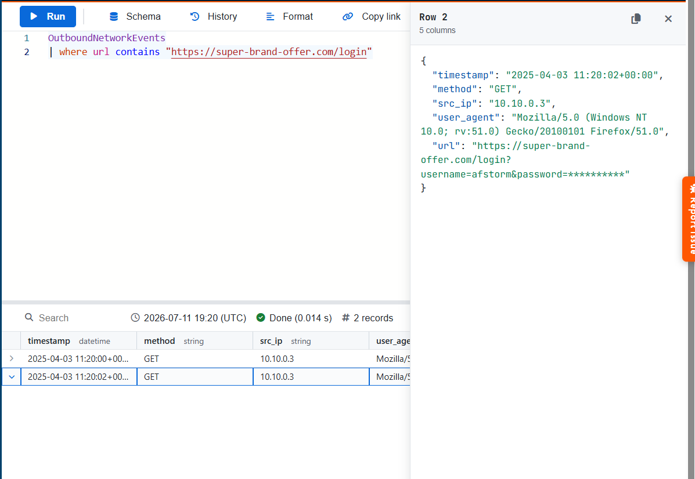

---

### Step 6 — Map the phishing infrastructure
Ran `PassiveDNS` on the phishing domain to find its hosting IP.

```kql
PassiveDns
| where domain contains "super-brand-offer.com"
```

**Finding:** Resolves to `198.51.100.12`.

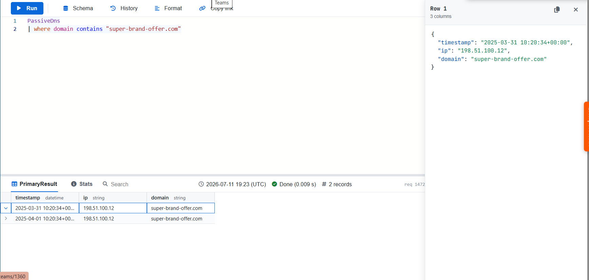

---

### Step 7 — Pivot on the IP to find related infrastructure
```kql
PassiveDns
| where ip contains "198.51.100.12"
| distinct domain
```

**Finding:** `super-brand-offer.com`, `dior-partners.com`, and `influencer-deals.net` all sit on the same IP — confirming these are one attacker's infrastructure, not three unrelated incidents.

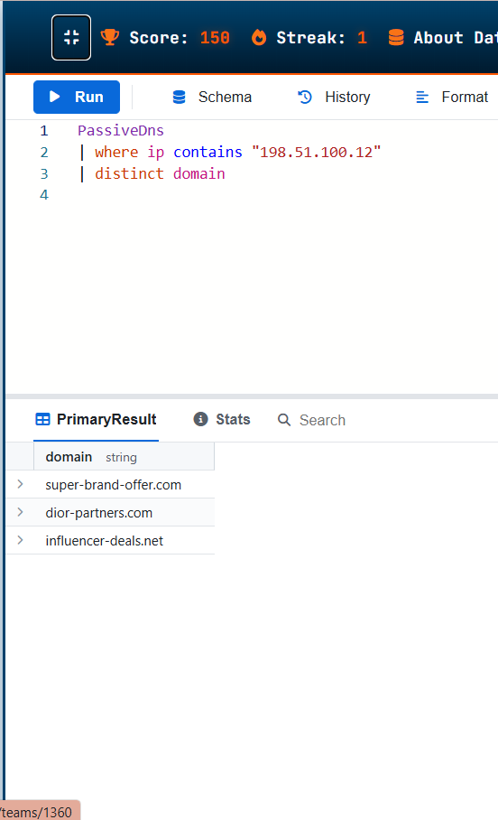

---

### Step 8 — Confirm the account takeover
With stolen credentials in hand, checked `AuthenticationEvents` for logins to `afstorm`.

```kql
AuthenticationEvents
| where username == "afstorm"
```

**Finding:** A **Successful Login** from `182.45.67.89`, using a strikingly outdated user agent (`Mozilla/5.0 (compatible; MSIE 5.0; Windows NT 5.2; Trident/4.1)`) — nothing like her real baseline (`OQPA-DESKTOP`, modern Firefox, `10.10.0.3`). This is the account takeover moment, roughly one hour after she clicked the phishing link.

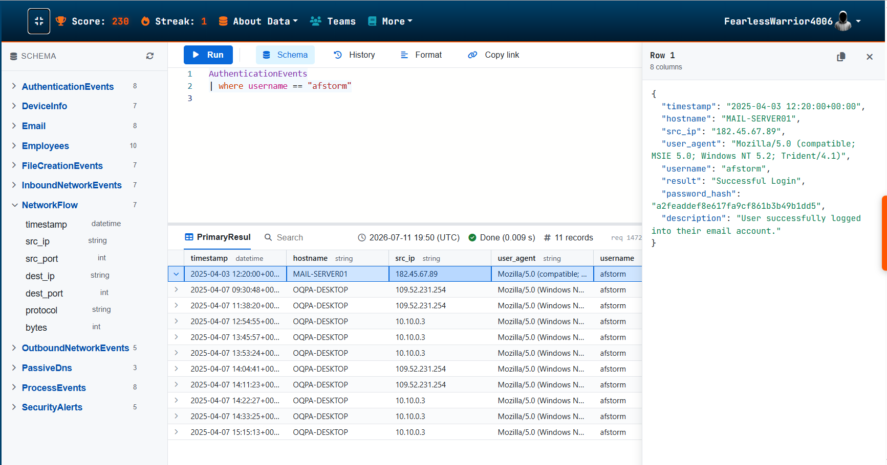

---

### Step 9 — Attribute the login IP back to the same campaign
```kql
PassiveDns
| where ip == "182.45.67.89"
```

**Finding:** Same domains again — `influencer-deals.net` and `dior-partners.com` — tying the login IP directly to the phishing infrastructure from Step 7. One actor, start to finish.

A quick IP lookup also places this address geographically:

| IP Address | Location | Network |
|---|---|---|
| `182.45.67.89` | Jinan, Shandong, China (CN), Asia | `182.45.0.0/17` |

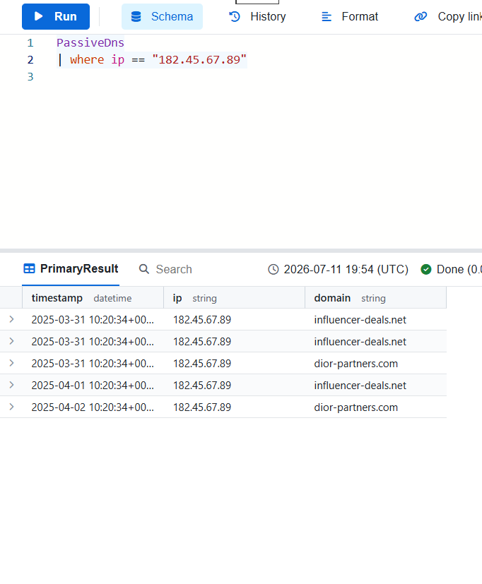

---

### Step 10 — Build the full authentication timeline
```kql
AuthenticationEvents
| where username == "afstorm"
| project timestamp, src_ip, user_agent, result
```

**Finding:** Over the following days, logins bounce between `182.45.67.89`, `109.52.231.254`, and her real `10.10.0.3` — a mix of Failed and Successful attempts, all still reporting hostname `OQPA-DESKTOP`. The fact that `109.52.231.254` resurfaces later attacking her *personal* Gmail (Step 14) is a strong signal that IP belongs to the attacker as well, not to Afomiya — this warrants flagging both non-baseline IPs as suspicious rather than assuming only `182.45.67.89` is hostile.

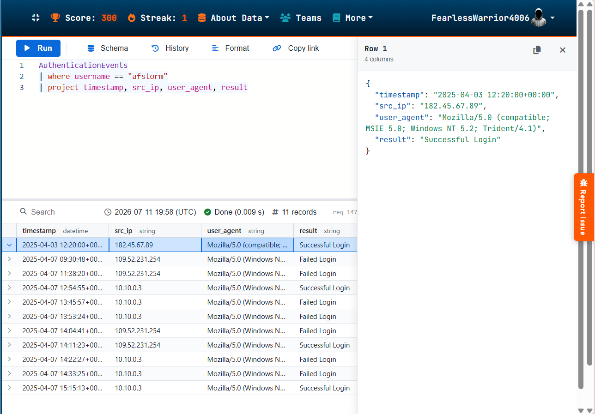

---

### Step 11 — Reconstruct the attacker's recon on the victim personally
Pivoted to `InboundNetworkEvents`, filtering on the attacker's distinctive user agent.

```kql
InboundNetworkEvents
| where user_agent contains "Windows NT 5.2"
```

**Finding (47 records):** the attacker used CloutHaus's own site search to research Afomiya as a person, not just as an employee:

> `"How to hack an influencer's location from their Instagram story"`

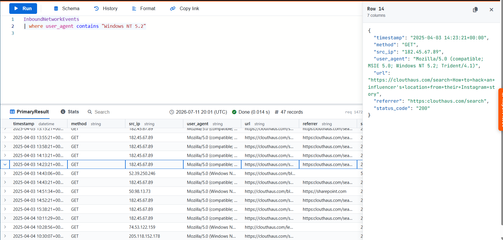

---

### Step 12 — Recon continues: home address
```kql
InboundNetworkEvents
| where user_agent contains "Windows NT 5.2"
| where url contains "friend"
```

**Finding:**
> `"Afomiya Storm home address?? (asking for a friend)"`

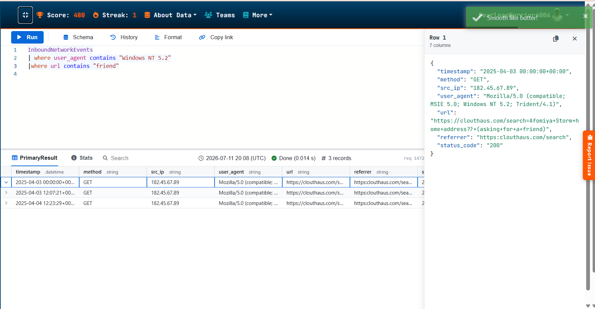

---

### Step 13 — Recon continues: financial exposure
```kql
InboundNetworkEvents
| where url contains "venmo"
```

**Finding:**
> `"Afomiya's Venmo history - is that public??"`

This confirms the attacker isn't just after corporate data — they're profiling her personally for follow-on fraud (which shows up next, on Instagram).

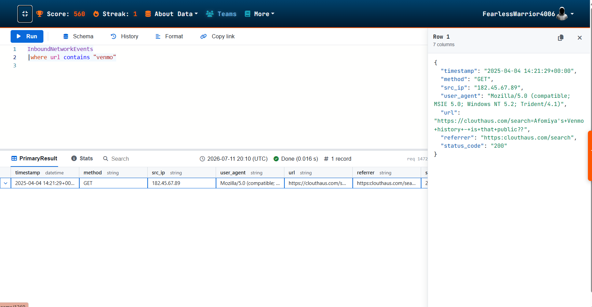

---

### Step 14 — The Instagram hijack (parallel track)
Outside the SIEM data, the case narrative confirms the payoff of that recon: Afomiya's Instagram is hijacked, and the attacker immediately begins DMing her followers asking for money under the guise of "exclusive investment opportunities" — leveraging her audience's trust in *her*, not just her corporate access.

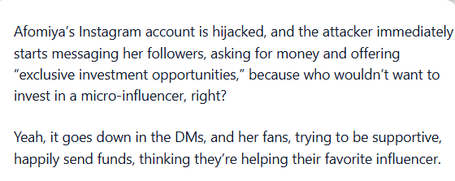

---

### Step 15 — Data exfiltration from inside the mailbox
Checked `Email` for messages sent **from** her address rather than to it — a strong signal of an attacker operating inside her mailbox.

```kql
Email
| where sender contains "afomiya_storm@clouthaus.com"
| where subject contains "Forw"
```

Then broadened the search for sensitive-document exfiltration patterns:

```kql
Email
| where sender == "afomiya_storm@clouthaus.com"
| where subject has_any ("Deposit", "Payroll", "ACH", "Form", "Bank", "Wire", "passport")
```

**Finding (4 records):** A string of `[EXTERNAL] [FORWARD]` emails, all sent to `noreply@influencer-deals.net` (the same attacker domain from Step 7), all marked **CLEAN** by the mail filter:

**NDA agreement:**
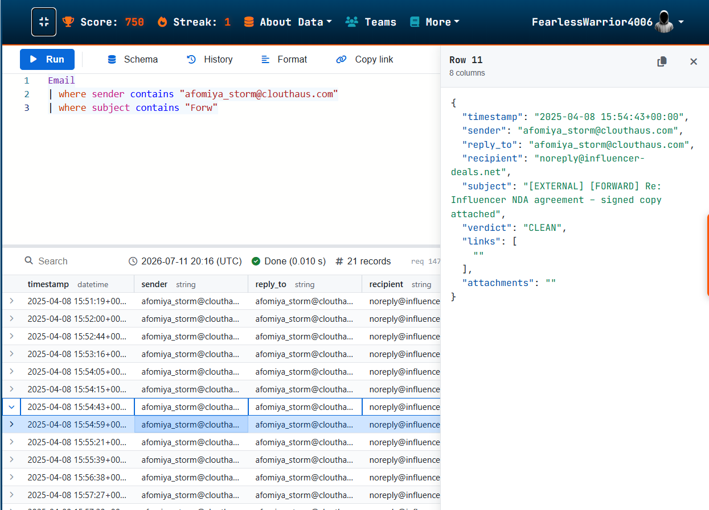

**Payment/direct deposit details:**
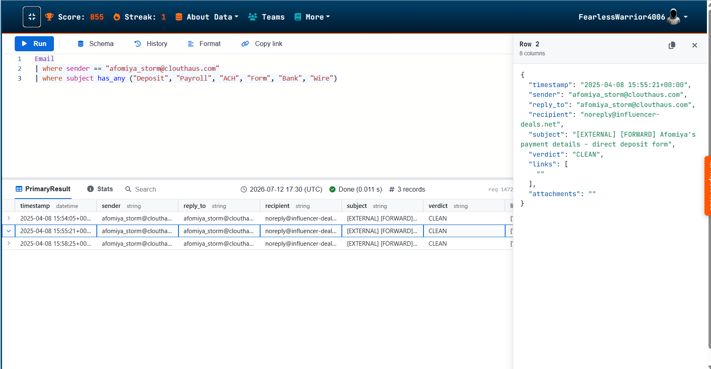

**Passport scan:**
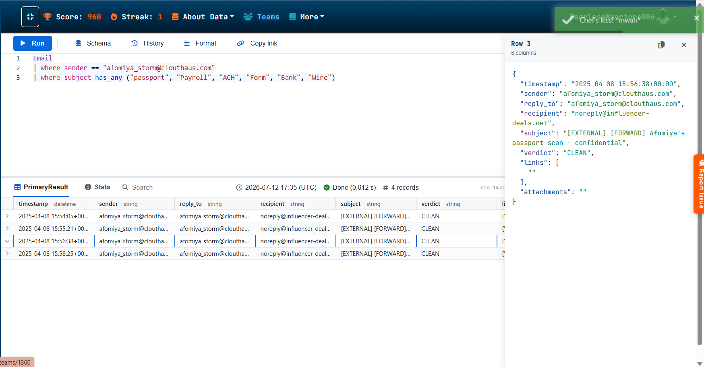

A final message in the same thread (`[EXTERNAL] [FORWARD] Re: Re: Re: Afomiya's bank statement – confidential`) shows the attacker patiently working through the same "Forward" pattern across multiple sensitive documents, all waved through as CLEAN.

---

### Step 16 — The long game: attacking her personal Gmail
Weeks later, a `GET` request appears targeting Google's account-recovery flow directly — with the security question *answers* passed straight in the URL:

```
GET https://gmail.com/account/security-questions?
    question_1=what's+the+name+of+your+first+school&answer_1=Lalibela
    &question_2=what's+your+mother's+maiden+name&answer_2=Kidus
src_ip: 109.52.231.254
user_agent: Mozilla/5.0 (compatible; MSIE 6.0; Windows ...)
timestamp: 2025-04-20 03:33:33
status: 200
```

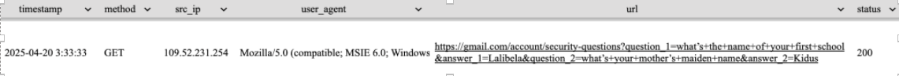

**Finding:** the answers submitted — `Lalibela` (her first school) and `Kidus` (her mother's maiden name) — are an exact, word-for-word match to what she posted publicly in her Instagram Q&A sticker in Step 1. This isn't a lucky guess or a data-broker lookup; the attacker simply scrolled her Story highlights. The request returns `200`, meaning the account-recovery flow accepted the attempt.

This is the attacker converting everything learned across the corporate breach — plus five minutes of profile browsing — into a second, independent takeover attempt on an account entirely outside CloutHaus's visibility or control. No amount of corporate MFA or email filtering would have stopped this one; it required Afomiya herself not answering security-question trivia in public.

---

## MITRE ATT&CK Mapping

| Tactic | Technique | Evidence |
|---|---|---|
| Reconnaissance | T1593.001 – Search Open Websites/Domains: Social Media | Public Instagram bio/Q&A sticker exposing personal email, hometown, mother's maiden name, first school |
| Initial Access | T1566.002 – Phishing: Spearphishing Link | Fake Dior partnership email |
| Credential Access | T1598.003 – Phishing for Information (credential harvesting page) | `super-brand-offer.com/login` capturing creds via GET |
| Defense Evasion | T1036 – Masquerading | Spoofed brand domain, mail filter marked malicious mail CLEAN |
| Initial Access / Persistence | T1078 – Valid Accounts | Login as `afstorm` with stolen credentials, no MFA |
| Reconnaissance | T1589 – Gather Victim Identity Information | Site searches for home address, Venmo, personal details |
| Collection | T1114.001 – Email Collection (Local) | Attacker forwards NDA, banking form, passport scan |
| Exfiltration | T1567 – Exfiltration Over Web Service | Forwarded to `noreply@influencer-deals.net` |
| Impact | Social Engineering via Compromised Trusted Account | Instagram hijack used to solicit money from followers |
| Credential Access | T1589.001 / Account Recovery Abuse | OSINT-derived answers used against Gmail security questions |

---

## IOC Table (defanged)

| Indicator | Type | Context |
|---|---|---|
| `hxxps://super-brand-offer[.]com/login` | URL | Credential-harvesting page |
| `super-brand-offer[.]com` | Domain | Phishing infrastructure |
| `dior-partners[.]com` | Domain | Spoofed sender domain |
| `influencer-deals[.]net` | Domain | Exfil drop-off domain |
| `198.51.100.12` | IP | Hosting for phishing domains |
| `182.45.67.89` | IP | Attacker login/browsing source — geolocates to Jinan, Shandong, CN |
| `109.52.231.254` | IP | Secondary suspicious IP — appears in mixed auth results and in the later Gmail security-question attack |
| `collabs@dior-partners.com` | Email | Phishing sender |
| `noreply@influencer-deals.net` | Email | Exfiltration recipient |
| `Mozilla/5.0 (compatible; MSIE 5.0; Windows NT 5.2; Trident/4.1)` | User-Agent | Anomalous attacker UA on corporate systems |
| `Mozilla/5.0 (compatible; MSIE 6.0; Windows NT ...)` | User-Agent | Anomalous attacker UA on the Gmail recovery attempt |

---

## Root Cause & Control Gaps
- **No MFA** on the influencer partner account — the single biggest gap; a stolen password alone was enough for full account takeover.
- **Mail filter blind spot** — both the initial phishing email and the *outbound* exfiltration emails were verdict CLEAN. The filter trusts internal senders and brand-style content without checking destination domains or forwarding patterns.
- **No anomalous login detection** — a login from a different IP/User-Agent than baseline wasn't flagged or challenged.
- **No outbound forwarding-rule monitoring** — a real SOC would want alerting on forwarding rules or a burst of `[FORWARD]` mail to a domain that's never previously received mail from the org.
- **Personal oversharing as an attack surface** — none of CloutHaus's controls can protect an employee's personal Gmail, but the corporate breach directly enabled the attempt on it. Security-awareness training needs to cover this handoff explicitly.

## Recommendations
1. Enforce MFA org-wide, no exceptions for contractor/partner-tier roles.
2. Add anomaly detection on login IP/ASN and User-Agent vs. per-user baseline (impossible travel, stale/unusual UA strings).
3. Extend mail filtering to inspect *outbound* mail for forwarding to external, newly-registered, or reputation-poor domains.
4. Alert on mailbox rule creation — a common post-compromise persistence/exfil technique.
5. Extend user awareness training to personal-account hygiene: public-facing employees should be specifically warned that Instagram/TikTok "Q&A sticker" games are a direct pipeline to account-recovery answers, and should switch personal accounts to app-based MFA rather than relying on security questions at all.
6. Brand-partnership phishing targeting influencers/public-facing employees is a distinct pattern worth specific training.

---

## Tools Used
- KC7 SOC simulation platform (KQL against `Employees`, `Email`, `AuthenticationEvents`, `OutboundNetworkEvents`, `InboundNetworkEvents`, `PassiveDns`)

## Author
Prapul Upendrakumar — [LinkedIn](https://linkedin.com/in/prapul123) | [TryHackMe](https://tryhackme.com/p/prapul.2004)
